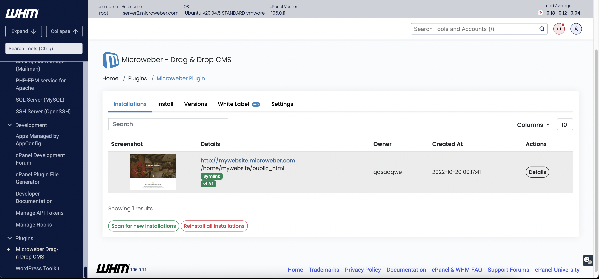

# Hosting Panel

You can choose b a hosting panel according to what you like.

We have an automated plugin that allows the installation of microweber sites easily.

Here is cPanel what look like&#x20;

<figure><figcaption>
This is the screenshot of the our cPanel auto provision plugin.
</figcaption></figure>


[cpanel.md](cpanel.md)


Here is Plesk what look like&#x20;

<figure><figcaption>
This is the screenshot of the our Plesk auto provision plugin.
</figcaption></figure>


[plesk.md](plesk.md)


Select the hosting panel to continue process:
